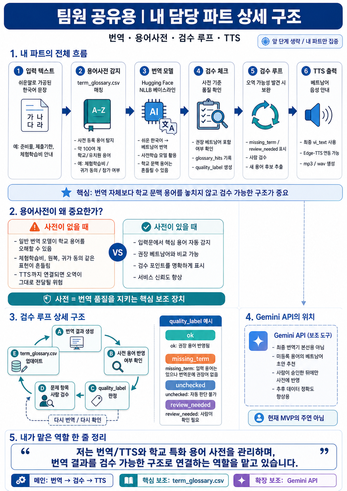

# Translation TTS Lab

학교/유치원 가정통신문을 다문화 가정 학부모가 이해하기 쉬운 베트남어 안내문과 음성으로 변환하는 모델 파이프라인 실험 폴더입니다.

현재 목표는 번역 모델을 새로 학습시키는 것이 아니라, **사전학습 번역 모델 + 학교 특화 용어 사전 + 검수 루프 + TTS**를 확정하고 백엔드/앱에서 연결할 수 있는 입출력 형태로 준비하는 것입니다.

## 파이프라인 한 줄 설명

가정통신문 원문을 입력하면 핵심 내용을 쉬운 한국어로 정리하고, 베트남어 번역과 학교 용어 검수를 거쳐 음성 안내까지 생성합니다.

```text
가정통신문 원문
-> 베이스라인 분석/요약
-> 쉬운 한국어 변환
-> Hugging Face NLLB 베트남어 번역
-> term_glossary.csv 기반 학교 용어 검수
-> 베트남어 TTS 음성 출력
```

## 담당 파트 구조

아래 이미지는 번역, 용어사전, 검수 루프, TTS가 어떻게 연결되는지 한 장으로 정리한 구조도입니다.



## 내일 전까지 확정할 것

- 모델 실행 방식: Docker 기반 Python 파이프라인
- 번역 모델: Hugging Face NLLB
- TTS 모델: MMS-TTS Vietnamese
- 사전 파일: `translation/term_glossary.csv`
- 백엔드 연결용 통합 결과: `outputs/mvp/mvp_result.csv`
- 검수 표시 결과: `outputs/mvp/05_glossary_check.csv`
- 음성 출력: `outputs/mvp/06_tts_output.wav`

## 현재 핵심 포인트

- Hugging Face의 사전학습 번역 모델 `facebook/nllb-200-distilled-600M`을 베이스라인으로 사용합니다.
- 학교/유치원 가정통신문 특화 용어 사전 `translation/term_glossary.csv`를 구축했습니다.
- 사전 용어가 번역문에 권장 베트남어로 반영되지 않으면 검수 대상으로 표시합니다.
- Gemini API는 최종 번역기가 아니라, 추후 미등록 용어의 베트남어 초안 추천을 돕는 보조 도구로 둡니다.
- 현재는 베트남어 MVP지만, 언어별 사전을 추가하면 중국어, 영어, 러시아어, 몽골어 등으로 확장할 수 있습니다.

## 기술 스택

| 영역 | 사용 기술 |
| --- | --- |
| 실행 환경 | Python 3.11, Docker, Docker Compose |
| 번역 모델 | Hugging Face Transformers, `facebook/nllb-200-distilled-600M` |
| TTS 모델 | Hugging Face Transformers, `facebook/mms-tts-vie` |
| 딥러닝 런타임 | PyTorch |
| 음성 파일 저장 | SciPy WAV writer |
| 데이터 처리 | CSV, JSON, Python 표준 라이브러리 |
| 용어 사전 | `translation/term_glossary.csv` |
| 검수 루프 | `glossary_hits`, `quality_label`, `glossary_check.csv` |
| 추후 보조 API | Gemini API, 미등록 용어 번역 초안 추천용 |

## 폴더 구조

```text
translation-tts-lab/
  data/                 # 가정통신문 샘플 CSV
  translation/          # 번역, 사전 검수, MVP 파이프라인 스크립트
  tts/                  # MMS-TTS 실험 스크립트
  docs/                 # 브리핑 및 설계 문서
  outputs/              # 생성 결과물
  models/               # Hugging Face 모델 캐시, git 제외
```

## E2E 실행

Docker Desktop을 켠 뒤 실행합니다.

```cmd
docker compose run --rm lab python translation/run_mvp_pipeline.py --input data/notice_sample_v3.csv --row-id 1 --output-dir outputs/mvp
```

생성 결과는 백엔드 연결 시 필드 계약으로 사용할 수 있습니다.

| File | 설명 |
| --- | --- |
| `outputs/mvp/01_input_notice.txt` | 입력 가정통신문 원문 |
| `outputs/mvp/02_baseline_result.json` | 카테고리, 키워드, 사전 감지 결과 |
| `outputs/mvp/03_easy_ko.txt` | 쉬운 한국어 문장 |
| `outputs/mvp/04_vi_translation.txt` | 베트남어 번역 결과 |
| `outputs/mvp/05_glossary_check.csv` | 학교 용어 검수 결과 |
| `outputs/mvp/06_tts_output.wav` | 베트남어 음성 출력 |
| `outputs/mvp/mvp_result.csv` | 전체 결과 통합 파일, 백엔드 연결 후보 |

TTS를 생략하고 빠르게 확인하려면:

```cmd
docker compose run --rm lab python translation/run_mvp_pipeline.py --input data/notice_sample_v3.csv --row-id 1 --output-dir outputs/mvp --skip-tts
```

## 학교 용어 사전

`translation/term_glossary.csv`는 학교/유치원 안내문에서 자주 등장하는 한국어 용어와 권장 베트남어 표현을 관리합니다.

예시:

| Korean | Preferred Vietnamese | 용도 |
| --- | --- | --- |
| 체험학습 | hoạt động trải nghiệm | 학교 체험 활동 |
| 귀가 동의 | đồng ý cho ra về | 제출/동의 |
| 준비물 | đồ cần chuẩn bị | 준비물 범주 |
| 원복 | đồng phục | 유치원 지정 복장 |
| 학교종이 | School Bell | 서비스명 |

검수 라벨:

| Label | 의미 |
| --- | --- |
| `ok` | 입력문에 나온 사전 용어가 번역문에도 권장 베트남어로 반영됨 |
| `missing_term` | 입력문에 사전 용어가 있었지만 번역문에 권장어가 없음 |
| `unchecked` | 사전 용어가 없어 자동 판단 불가 |
| `review_needed` | 사람이 확인해야 하는 항목 |

## 사전 확장 루프

새로운 가정통신문이 들어오면 미등록 용어 후보를 추출하고, 사람이 검수한 뒤 사전에 추가합니다.

```cmd
python translation/extract_glossary_candidates.py --input data/notice_sample_v3.csv --output outputs/translation/glossary_candidates.csv
```

추후 Gemini API는 아래처럼 보조 도구로만 사용합니다.

```text
미등록 용어 후보 추출
-> Gemini가 베트남어 초안 추천
-> 사람이 검수
-> 승인된 표현만 term_glossary.csv에 추가
```

승인된 후보만 사전에 병합합니다.

```cmd
python translation/import_approved_glossary_candidates.py --candidates outputs/translation/glossary_candidates_gemini.csv
```

## 번역 품질 확인

20개 샘플 번역:

```cmd
docker compose run --rm lab python translation/run_nllb_translate.py --input data/notice_sample_v3.csv --output outputs/translation/nllb_v3_glossary_20.csv --limit 20
```

사전 기준 품질 체크:

```cmd
python translation/check_translation_quality.py --input outputs/translation/nllb_v3_glossary_20.csv --output outputs/translation/nllb_v3_glossary_20_checked.csv
```

## TTS 단독 실행

번역 결과 CSV에서 베트남어 문장을 음성으로 변환합니다.

```cmd
docker compose run --rm lab python tts/run_mms_tts.py --input outputs/translation/nllb_v3_glossary_20.csv --text-column prediction_vi --output-dir outputs/tts/vie --limit 5
```

## 연결 포인트

백엔드에서 가장 먼저 연결하기 좋은 파일은 `outputs/mvp/mvp_result.csv`입니다.

주요 컬럼:

| Column | 설명 |
| --- | --- |
| `source_text` | 입력 원문 |
| `category` | 분류 결과 |
| `keywords` | 핵심 키워드 |
| `easy_ko_text` | 쉬운 한국어 |
| `vi_text` | 베트남어 번역 |
| `glossary_hits` | 입력문에서 감지된 사전 용어 |
| `quality_label` | 검수 상태 |
| `quality_note` | 검수 사유 |
| `tts_path` | 생성된 음성 파일 경로 |

API로 붙일 때는 같은 구조를 JSON으로 반환하면 됩니다.

```json
{
  "source_text": "...",
  "category": "준비물",
  "easy_ko_text": "...",
  "vi_text": "...",
  "glossary_hits": ["도화지->giấy vẽ"],
  "quality_label": "review_needed",
  "quality_note": "도화지->giấy vẽ",
  "tts_path": "outputs/mvp/06_tts_output.wav"
}
```

## 문서

전체 방향 요약은 아래 문서에 정리했습니다.

```text
docs/mvp_briefing.md
```

핵심 메시지:

> 일반 번역 모델을 그대로 쓰는 것이 아니라, 학교 안내문 문맥에서 중요한 용어를 사전 기반으로 감지하고 오역 가능성이 있는 문장을 검수 대상으로 분리합니다.

## 다음 작업

1. 실제 가정통신문 샘플을 더 넣어 E2E 반복 실행
2. 백엔드에서 `run_mvp_pipeline.py` 호출 또는 내부 함수화
3. `mvp_result.csv` 구조를 API 응답 JSON으로 변환
4. 앱에서 `vi_text`, `quality_label`, `tts_path` 표시
5. 미등록 용어는 후보 추출 후 사전 확장

## 현재 한계

- NLLB 원본 번역은 학교 문맥 용어를 안정적으로 처리하지 못합니다.
- 사전 검수는 문자열 포함 여부 기반이라 표현 변형을 완벽히 잡지는 못합니다.
- `term_glossary.csv`는 사람이 계속 확장해야 합니다.
- TTS 품질은 입력 번역문의 품질에 크게 의존합니다.
- 현재 데모는 베트남어 중심이며, 다국어 확장을 위해 언어별 사전과 음성 모델 검증이 필요합니다.
