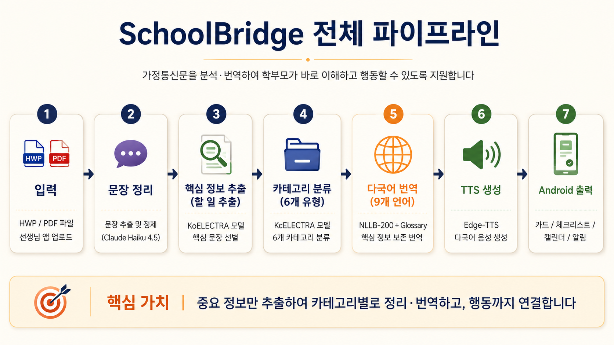
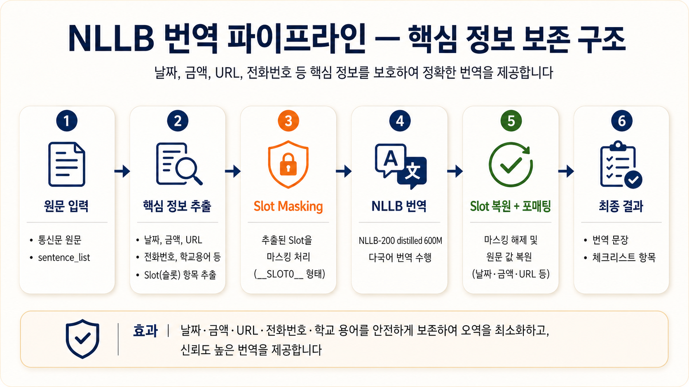
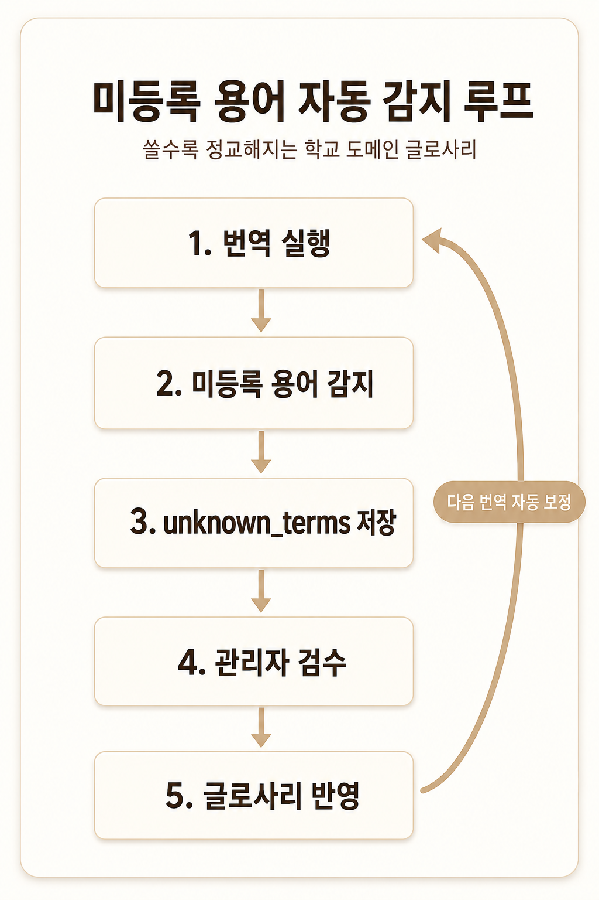

# Translation TTS Lab

SchoolBridge 팀 프로젝트에서 가정통신문 번역/TTS 파트의 품질을 검증하기 위해 만든 개인 실험 레포입니다. 단순히 TTS를 생성하는 저장소가 아니라, 학교 안내문 번역에서 날짜, 금액, URL, 전화번호, 학교 용어처럼 학부모 행동에 직접 영향을 주는 정보를 어떻게 보존할지 실험하고 정리했습니다.

이 레포에서 검증한 핵심은 **NLLB 번역 모델을 그대로 쓰지 않고, Slot Protection, Glossary Injection, Template-based Translation, 검수 루프를 조합해 핵심 정보 손실과 도메인 용어 오역을 줄이는 구조**입니다.



## 프로젝트 목적

다문화 가정 학부모가 학교 가정통신문을 이해하고 바로 행동할 수 있도록, 한국어 안내문을 쉬운 한국어와 대상 언어 번역문, 음성 안내로 변환하는 파이프라인을 검증했습니다.

프로젝트의 초점은 번역 모델 자체를 새로 학습시키는 것이 아니라, 사전학습 번역 모델인 `facebook/nllb-200-distilled-600M` 위에 학교 도메인 안전장치를 얹어 서비스에 사용할 수 있는 입출력 구조를 만드는 것이었습니다.

## 핵심 성과

| 항목 | 결과 |
| --- | ---: |
| 학교 용어 보존 | `1/17 -> 17/17` |
| 확장 용어 테스트 | `37/37 PASS` |
| 슬롯 복원 | `21/21 PASS` |
| 번역 품질 평가 | `39.0 -> 89.6` |
| 자체 테스트 | `125+ ALL PASS` |

## 문제 정의

일반 번역 모델은 학교 안내문에서 다음 정보를 안정적으로 보존하지 못할 수 있습니다.

| 문제 | 예시 |
| --- | --- |
| 날짜/시간 변형 | `5월 9일(금)` 같은 일정 정보가 대상 언어에서 불안정하게 표현됨 |
| 금액 오역 | `40,000원`이 사람 수나 다른 통화처럼 해석될 수 있음 |
| URL/전화번호 손실 | 링크, 전화번호가 토큰화 과정에서 깨지거나 누락됨 |
| 학교 용어 오역 | `리코더`, `클리어 화일`, `원복`, `스쿨뱅킹` 같은 표현이 일반 의미로 번역됨 |
| 준비물/제출물 누락 | 학부모가 실제로 해야 할 행동 정보가 번역문에서 약해짐 |

따라서 이 레포는 "번역이 자연스러운가"뿐 아니라 "중요한 값과 학교 용어가 보존되는가"를 중심으로 실험했습니다.

## 해결 전략



### Slot Protection

날짜, 금액, URL, 전화번호처럼 원문 값이 보존되어야 하는 정보는 NLLB 입력 전에 `__SLOT0__` 형태로 마스킹하고, 번역 후 원문 값 또는 언어별 포맷으로 복원합니다.

초기에는 특수문자 placeholder를 실험했지만 NLLB SentencePiece 토크나이저에서 깨지는 문제가 있어, ASCII 기반 슬롯 형식으로 전환했습니다.

```text
5월 9일(금)까지 신청서를 제출해 주세요
-> __SLOT0__까지 신청서를 제출해 주세요
-> NLLB 번역
-> 날짜 슬롯 복원
```

### Glossary Injection

학교/유치원 안내문에 자주 등장하는 도메인 용어를 `translation/term_glossary.csv`에 관리합니다. 번역 전후에 사전 용어가 권장 표현으로 반영되는지 확인하고, 누락되면 검수 대상으로 표시합니다.

| Korean | Preferred Vietnamese | 용도 |
| --- | --- | --- |
| 체험학습 | hoạt động trải nghiệm | 학교 체험 활동 |
| 귀가 동의 | đồng ý cho ra về | 제출/동의 |
| 준비물 | đồ cần chuẩn bị | 준비물 범주 |
| 원복 | đồng phục | 유치원 지정 복장 |
| 학교종이 | School Bell | 서비스명 |

검수 라벨:

| Label | 의미 |
| --- | --- |
| `ok` | 입력문에 나온 사전 용어가 번역문에도 권장 표현으로 반영됨 |
| `missing_term` | 입력문에 사전 용어가 있었지만 번역문에 권장어가 없음 |
| `unchecked` | 사전 용어가 없어 자동 판단 불가 |
| `review_needed` | 사람이 확인해야 하는 항목 |

### Template-based Translation

준비물, 제출물, 납부 안내처럼 학교 안내문에서 반복되는 행동 문장은 자유 번역보다 템플릿 기반 번역을 우선합니다.

이 방식은 문장을 먼저 구조화한 뒤, 대상/준비물/제출 대상/기한 같은 요소를 분리해 번역합니다. NLLB가 짧은 명사구를 잘못 해석하는 문제를 줄이고, 학부모가 해야 할 행동을 더 명확하게 전달하기 위한 전략입니다.

```text
원문 문장
-> 문장 유형 분류
-> 핵심 용어 추출
-> 대상/준비물/제출 대상/기한 분리
-> 템플릿 가능 문장은 템플릿 번역
-> 일반 문장은 NLLB fallback
```

### 미등록 용어 감지 루프

사전에 없는 용어는 `unknown_terms`로 남기고, 사람이 검수한 뒤 `term_glossary.csv`에 반영하는 흐름을 실험했습니다.



```text
번역 실행
-> 미등록 용어 감지
-> unknown_terms 저장
-> 관리자 검수
-> glossary 반영
-> 다음 번역 자동 보정
```

Gemini API는 최종 번역기가 아니라, 미등록 용어의 대상 언어 초안 추천을 돕는 보조 도구로만 둡니다. 승인된 표현만 사전에 병합하는 구조입니다.

### TTS 적용

최종 MVP 기준 TTS는 `translation/languages.py`의 Edge-TTS voice 매핑을 사용합니다.

| 구분 | 설명 |
| --- | --- |
| 최종 MVP | Edge-TTS voice 매핑 기반 mp3 생성 |
| 초기 실험 기록 | `tts/` 폴더의 MMS-TTS 코드 |

`tts/run_mms_tts.py`는 베트남어 MMS-TTS 모델을 검토했던 초기 실험 코드입니다. 삭제하지 않고 archive 성격의 실험 기록으로 보존합니다.

## 파이프라인 구조

```text
가정통신문 원문
-> 핵심 문장/정보 추출
-> 쉬운 한국어 변환
-> Slot Protection
-> Glossary Injection 또는 Template-based Translation
-> NLLB fallback
-> Slot 복원 + 포매팅
-> Glossary 검수
-> Edge-TTS 음성 생성
-> mvp_result.csv 통합
```

출력 경로는 아래 구조를 기준으로 정리합니다.

```text
outputs/mvp/{lang}/
  01_input_notice.txt
  02_baseline_result.json
  03_easy_ko.txt
  04_translation.txt
  05_glossary_check.csv
  06_tts_output.mp3
  mvp_result.csv
```

주요 출력 파일:

| File | 설명 |
| --- | --- |
| `01_input_notice.txt` | 입력 가정통신문 원문 |
| `02_baseline_result.json` | 카테고리, 키워드, 사전 감지 결과 |
| `03_easy_ko.txt` | 쉬운 한국어 문장 |
| `04_translation.txt` | 대상 언어 번역 결과 |
| `05_glossary_check.csv` | 학교 용어 검수 결과 |
| `06_tts_output.mp3` | 대상 언어 음성 출력 |
| `mvp_result.csv` | 전체 결과 통합 파일 |

API 응답으로 연결할 때는 같은 구조를 JSON으로 반환할 수 있습니다.

```json
{
  "source_text": "...",
  "category": "준비물",
  "easy_ko_text": "...",
  "vi_text": "...",
  "glossary_hits": ["도화지->giấy vẽ"],
  "quality_label": "review_needed",
  "quality_note": "도화지->giấy vẽ",
  "tts_path": "outputs/mvp/vi/06_tts_output.mp3"
}
```

## 실행 방법

기술 스택:

| 영역 | 사용 기술 |
| --- | --- |
| 실행 환경 | Python 3.11, Docker, Docker Compose |
| 번역 모델 | Hugging Face Transformers, `facebook/nllb-200-distilled-600M` |
| 최종 MVP TTS | Edge-TTS voice 매핑 |
| 초기 TTS 실험 | MMS-TTS (`facebook/mms-tts-vie`) |
| 딥러닝 런타임 | PyTorch |
| 데이터 처리 | CSV, JSON, Python 표준 라이브러리 |
| 용어 사전 | `translation/term_glossary.csv` |
| 검수 루프 | `glossary_hits`, `quality_label`, `glossary_check.csv` |
| 보조 API | Gemini API, 미등록 용어 번역 초안 추천용 |

E2E MVP 파이프라인:

```cmd
python translation/run_mvp_pipeline.py --input data/notice_sample_v3.csv --row-id 1 --lang vi --output-dir outputs/mvp/vi
```

TTS를 생략하고 빠르게 확인:

```cmd
python translation/run_mvp_pipeline.py --input data/notice_sample_v3.csv --row-id 1 --lang vi --output-dir outputs/mvp/vi --skip-tts
```

미등록 용어 감지와 glossary 확장은 최종 MVP에서 사용할 운영 루프로 정리했습니다. 현재 레포에는 `translation/term_glossary.csv`, `translation/fill_glossary_all_langs.py`, `translation/validate_glossary_with_gemini.py` 등 사전 확장과 검증을 위한 실험 코드가 남아 있습니다.

## 실험 결과 재현

번역 품질과 glossary 효과를 확인하는 스크립트입니다.

```cmd
python translation\run_ab_compare.py --lang vi --device cpu
python translation\run_ab_quality_eval.py --lang vi
python translation\run_glossary_compare.py --lang vi en zh th ja ru ms mn
python translation\run_quality_eval.py
```

최근 실험 요약:

| 항목 | 결과 |
| --- | ---: |
| A/B 입력 단축 | `-30.1%` |
| A/B 속도 향상 | `x1.84` |
| A/B 품질 평가 | `A 45.8점 / B 50.1점` |
| 용어사전 전/후 품질 평가 | `39.0점 -> 89.6점` |

관련 산출물은 `outputs/`와 `docs/` 아래에 보존합니다. 오래된 비교 실험과 중간 산출물은 삭제하지 않고 초기 실험 기록으로 유지합니다.

## 폴더 구조

```text
translation-tts-lab/
  archive/              # 이전 실험 스냅샷과 보존 자료
  data/                 # 가정통신문 샘플 CSV
  docs/                 # 실험 결과, 발표 근거, 전략 문서
  outputs/              # 번역/TTS/평가 산출물
  tests/                # 검증 테스트
  translation/          # NLLB 번역, glossary, slot/template 실험 코드
  tts/                  # MMS-TTS 초기 실험 코드
  README.md             # 포트폴리오용 요약 문서
```

## 문서 링크

| 문서 | 내용 |
| --- | --- |
| `docs/final-presentation-retrospective-2026-05-13.md` | 최종 발표 이후 번역/TTS 파트 성과와 피드백 |
| `docs/presentation-evidence.md` | 발표에서 사용한 근거와 실패 사례 |
| `docs/slot_protected_translation.md` | 날짜/시간/금액/URL/전화번호 보호 번역 설계 |
| `docs/template_translation_controlled_experiment_20260506.md` | 템플릿 번역 실험과 비교 결과 |
| `docs/translation-model-strategy-2026-05-07.md` | NLLB 유지, SMaLL-100 비교, 최종 번역 전략 |
| `docs/nllb_vs_small100_result.md` | NLLB와 SMaLL-100 비교 실험 |
| `docs/mvp_briefing.md` | MVP 파이프라인 브리핑 |
| `개발일지_모세종.md` | 개인 작업 로그 |

## 한계와 개선 방향

- NLLB 원본 번역은 학교 문맥 용어를 안정적으로 처리하지 못하므로, glossary와 template 보정이 계속 필요합니다.
- 사전 검수는 문자열 포함 여부 기반이라 표현 변형을 완벽히 잡지는 못합니다.
- `term_glossary.csv`는 새로운 학교 안내문을 볼수록 사람이 검수하며 확장해야 합니다.
- 현재 실험은 베트남어 중심으로 검증했으며, 8개 언어 확장을 위해 언어별 사전과 TTS 품질 검증이 더 필요합니다.
- 최종 MVP는 Edge-TTS 기준으로 정리했지만, `tts/`의 MMS-TTS 코드는 초기 실험 기록으로 남아 있습니다.
